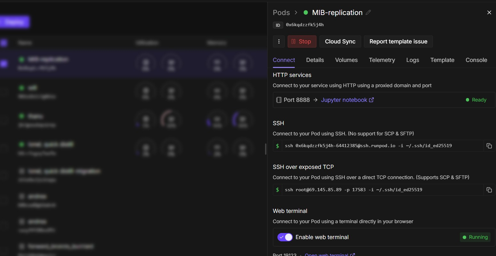
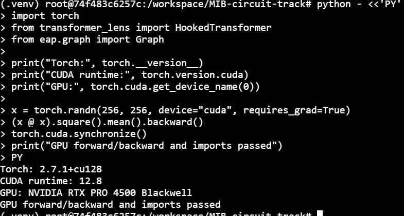
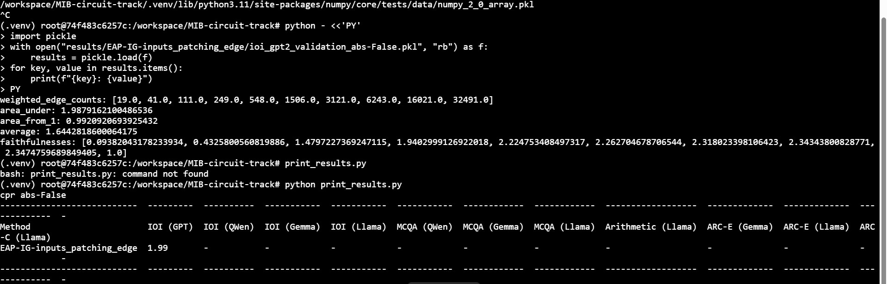

# Replicating Results from Circuit Localization Track of MIB

Reference paper - [MIB: A Mechanistic Interpretability Benchmark](https://arxiv.org/pdf/2504.13151)

## Overview

In order to prepare for benchmarking the computational graph condensation algorithm against MIB, I replicated the key results in the Circuit Localization Track from the MIB paper by recreating values noted under Table 2.

## Journal (w/ Problems Encountered)

Below is a journal of my progress. Problems encountered are **<u>bolded and underlined</u>**, and I have written up how I resolved them.

### MIB Close Reading

Below are the notes I took as I read. The original notes were taken on OneNote and I had ChatGPT rewrite it in mardown. 

<details>
<summary>
Close reading notes
</summary>


**Definition (MIB): Mechanistic Interpretability Benchmark**

Goal: Score mech. interp. methods by how precisely and concisely they recover relevant causal pathways.
- **Definition (causal): Stuff that actually matter cause AND effect**

Overall Structure
- Methods weighed against track 1 or 2 depending on what they do
- *Track 1: Circuit localization track for methods that*
  - Locate which parts of the neural network are responsible for what tasks
  - Look at how they connect to form a circuit
- *Track 2: Causal variable localization track for methods that*
  - Make hidden vectors into features
  - Looks at whether the features can be made task-relevant
  - Stuff like SAEs, DAS
- Four tasks
- Five models

Task Structure
- Various reasoning types, difficulty, 1output format
- Various familiarity
- They have training/validation
  - Users can discover circuits, casual variables on training sets; use validation for hyperparameters
- Public test set for quick training; upload to private testset API for testing

Four Tasks
1. IOI: Complete the object of a sentence
2. Arithmetic: +/− of all possible pairs $(x,y) \in \{0,\ldots,99\}^2$
3. MCQA: **Information to answer question is in the prompt**, test how the model does with MCQ in general
4. AI2 Reasoning Challenge (AIC): Test the model knowledge of science

**Methodology**
- Start by assessing how the model performs the task for a baseline
- Both tracks use **activation patching**
  - *Circuit localization track uses activation patching to test if messing with stuff outside circuit does not change prediction*
  - *Casual variable localization uses activation patching to see if messing with a variable has the intended effect*
  - The $f$: original input -> counterfactual input is fixed so the comparison is fair
- Use private test case to generate leaderboard

*Track 1: Circuit Localization Track specifics*
- *Circuit $C$ is a computational graph $N$ where*
  - *The nodes of $N$ are either an attention head (e.g. lay.59 head 23) or a layer of MLP*
  - *Edges are abstract, reflects how information flows*
  - **Definition (CPR): Find components that positively effect the behavior**
    - *Higher score is better*
    - *Find components encouraging behavior*
  - **Definition (CMD): Find components that impact the behavior at all**
    - *Lower score is better*
    - *Explain the full algorithm*
- *Measuring faithfulness: $f(C,N)=\frac{m(C)-m(\emptyset)}{m(N)-m(\emptyset)}$ where $m$ is the resulting logit difference $y'-y$ of correct/incorrect inputs*
- *To capture faithfulness and minimality at the same time*
  - *Look at (circuit size, faithfulness score) at different $\lambda$ thresholds*
  - *$k$ is the model size*
  - *$CPR=\int_0^1 f(C_k)\,dk$, **higher score better***
  - *$CMD=\int_0^1 |1-f(C_k)|\,dk$, **lower score better***
- *Size defined as $k=|C|=\sum_{(u,v)\in C}\left(\frac{|N_u\cap N_C|}{|N_u|}\right)$*
- *Three types of circuit discovery MIB was tested on*
  - *Attribution methods (EAP, EAP-IG, NAP, ...): Way of speeding up activation patching*
  - *Information Flow Routes (IFR): If the output of $u$ is similar to input of $v$, then let $(u,v)$ be in the circuit*
  - *Mask-based method (UGS): A model that tries to learn a pruning mask that cuts stuff from the curicuit*
- *Results*
  - *See table 2; EAP-IG achieves best score, IFR performs poorly*

(notes on track 2 ommitted because it is irrelevant to computational graph condensation)

Links
- Dataset https://huggingface.co/collections/mib-bench/mib-datasets
- Code https://github.com/aaronmueller/mib
- Leaderboard https://huggingface.co/spaces/mib-bench/leaderboard
</details>

### MIB Circuit Repository Setup

I used forked the repository containing the source code for the circuit track [into here](https://github.com/DenialRiver1434/MIB-circuit-track) then cloned it onto my VSC environment.

I spent plenty of time trying to install the dependencies due to the following problem.

**<u>Problem: The readme.md from the original repository does not contain the full instructions for installing dependencies</u>**

When I tried going through the steps, pip install . installed the wrong eap package. After checking the folders, it had installed EAP 1.1.14.1, an unrelated library. I asked Codex how to solve this and it told me to run ```pip install ./EAP-IG .``` which worked better.

Overall I had extra trouble because my primary laptop was broken and was working from a backup computer with weird installation settings.

### Checking out the source code

I looked around the source code and had Codex explain stuff to me. I took some notes for how MIB works

<details>
<summary>Things I jotted down</summary>

**MIB is run in two stages**
1.  ```run_attribution.py``` runs the circuit localization method we are trying to benchmark, allowing it to score how important each edge* is in its DAG
- Can select the model, method, task
- *Can also be set to scoring nodes/neurons by modifying [LEVELS]
- Stores it with ```graph.to_json(f'{circuit_path}/importances.json')```
2. ```run_evaluation.py``` then takes the graph generated by the method in ```run_attribution.py``` and assesses it based on the methods mentioned in the paper 

Specifics for 
```
python run_attribution.py
--models [MODELS]
--tasks [TASKS]
--method [METHOD]
--level [LEVEL="edge"]
--ablation [ABLATION="patching"]
--batch-size [BATCH_SIZE=20]
--circuit-dir [CIRCUIT-DIR="circuits/"]
```
The modifiers [MODELS], [TASKS], etc. get translated using MIB_circuit_track.utils. In the end, the key three points are,
- [MODELS] selects what AI model we are testing the circuit localization on
- [METHOD] is the method we are benchmarking
- [TASKS] selects what tests we are running with the AI and having the method analyze

Line 77 ```dataset = HFEAPDataset(...)``` calls the HFEAPDataset class and looks for the tokenized input for both the prompt and counterfactual prompt
- HFEAPDataset tokenized the prompt using ```from transformers import PreTrainedTokenizer```

</details>

### Figuring Out Runpod

I thought this was going to take 15 minutes. It ended up taking the entire day.

I did the following to start,
- Deployed a RTX 4090 pod "MIB-replication" under default configurations and with a volume disk
- Enabled the web terminal

- Downloaded the repository, along with all the dependencies and packages into the pod
- I tried using ```pip clear cache``` but eventually had to start over on a larger disk 

<details>

<summary>Reopening Terminal Commands</summary>

The pods are like computers (similar to AWS EC2 instances) and accessed through web terminal. Can download files through this way.

To reopen the terminal, 
- source /workspace/activate-mib.sh
- cd /workspace/MIB-circuit-track
- source .venv/bin/activate
</details>


**<u>Problem:</u> The installation of all the dependencies ended up being so large it did not fit on 20Gb**

**<u>Problem:</u> The installed files did not save when I paused and then relaunched in the morning even though I thought it was saved**

Since I had 3.091 class the next day, I connected Codex to Runpod the next day and had it run in the background to start a new pod. Since Codex didn't have SSH access, I had it install the packages.


**<u>Major Problem:</u> The code continued to fail, reporting that certain dependencies were missing** 
This took hours to figure out since the error messages were weird with multiple restarts, but it turned out the pod was installed with an image with Torch version 2.14 but requires a different version of torch. The following command fixed the issue:
```
python -m pip install \
  torch==2.4.1 torchvision==0.19.1 torchaudio==2.4.1 \
  --index-url https://download.pytorch.org/whl/cu124
```

**<u>Problem:</u> Received a warning that "NVIDIA RTX PRO 4500 Blackwell with CUDA capability sm_120 is not compatible with the current PyTorch installation."**

The guide (and codex) pointed to,
```
export PIP_CACHE_DIR=/workspace/cache/pip
export TMPDIR=/workspace/tmp
mkdir -p "$PIP_CACHE_DIR" "$TMPDIR"

python -m pip install --upgrade \
  torch==2.7.1 torchvision==0.22.1 torchaudio==2.7.1 \
  --index-url https://download.pytorch.org/whl/cu128
```


### Recreating a Basic Set of Results

After consulting Codex, I was told that ```[MODEL] = GPT-2; [TASKS] = IOI; [METHOD] = EAP-IG-inputs``` would be a good starting point. Checking the values in Table 2 and Table 14, the recorded CMD was 0.03 and CPR was 1.85 respectively.

I started with running a test to replicate the CMD value. In particular, I had Codex write up a Python script that prints out detailed results including the faithfulness at all the levels to do a sanity check.

<details>

<summary>CMD Replication test (GPT-2/IOI/EAG-IG-inp.)</summary>

Training:
```
python -u run_attribution.py \
  --models gpt2 --tasks ioi \
  --method EAP-IG-inputs --ig-steps 5 \
  --ablation patching --level edge \
  --split train --num-examples 8 --head 8 --batch-size 1 \
  --circuit-dir circuits-smoke
  ```
Evaluation:
```
python -u run_evaluation.py \
  --models gpt2 --tasks ioi \
  --method EAP-IG-inputs \
  --ablation patching --level edge --absolute \
  --split validation --head 8 --batch-size 1 \
  --circuit-dir circuits-smoke --output-dir results-smoke
```

Here's the Python script codex made to display detailed output.

```
python - <<'PY'
import pickle
with open("results-smoke/EAP-IG-inputs_patching_edge/ioi_gpt2_validation_abs-True.pkl", "rb") as f:
    results = pickle.load(f)
for key, value in results.items():
    print(f"{key}: {value}")
PY
```

</details>

<details>

<summary>CMD Test results </summary>

Using the script, I got much more detailed results and it all checks out.

CPR → 0.9654
CMD → 0.0441

```
weighted_edge_counts: [22.0, 50.0, 142.0, 289.0, 611.0, 1569.0, 3242.0, 6498.0, 16245.0, 32491.0]
area_under: 0.9653902172751483
area_from_1: 0.04412530505505405
average: 0.6665325967025308
faithfulnesses: [0.019733655092845453, 0.0887017567842513, 0.30987243945853277, 0.6089829995759188, 0.9111720307934588, 0.8767607049910842, 0.9323771262762143, 0.9045808511402504, 1.013144402912753, 1.0]
```
Everything else checks out.

</details>

For replicating the ```CPR = 1.85```, I tried to write up the commands and replicate the values myself without Codex help. I immediately ran into a **<u>problem</u>** where the run would end when I exited the terminal so I had to ask Codex for help. It told me to run it with nohup instead.

<details>

<summary>CPR Replication Test (GPT-2/IOI/EAG-IG-inp.)</summary>

This time I wrote the commands myself based on the readme.md.

```
python run_attribution.py --models gpt2 --tasks ioi --method EAP-IG-inputs
```

```
nohup python run_evaluation.py --models gpt2 --tasks ioi --method EAP-IG-inputs
```

</details>

<details>

<summary>CPR Test Results</summary>

From ```print_results.py```, the CMD was 0.99 and CPR 1.99. 




</details>

Each test took roughly 30 minutes to finish.